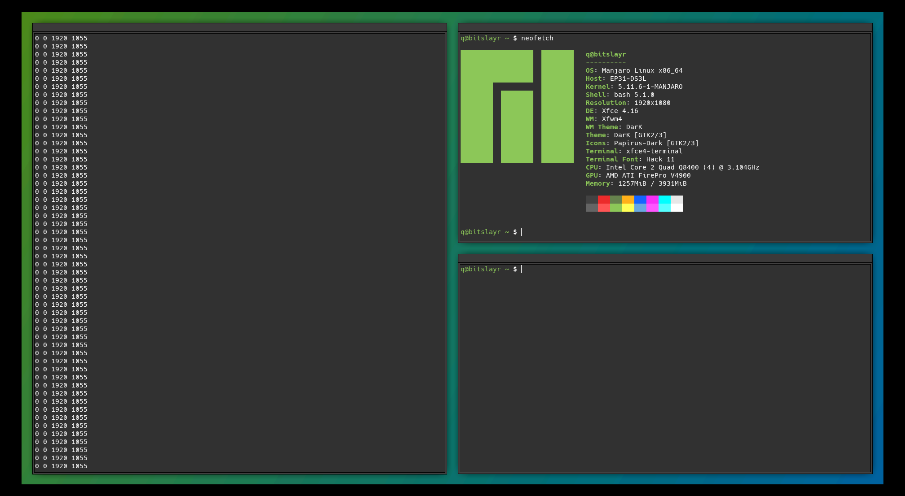

PyTyle is an extremely versatile and extensible tiling manager that is meant
to be used on top of EWMH window managers. Its feature set was modeled after
the basic tiling features of XMonad.

This is a fork of the [original PyTyle](http://github.com/BurntSushi/pytyle1),
adjusted to work with Python 3. Development continues, and you can expect optimizations, new features and bug fixes.

Install with `pip install pytyle1x`. Check out [the wiki](https://github.com/programical/pytyle1x/wiki) for more details.

